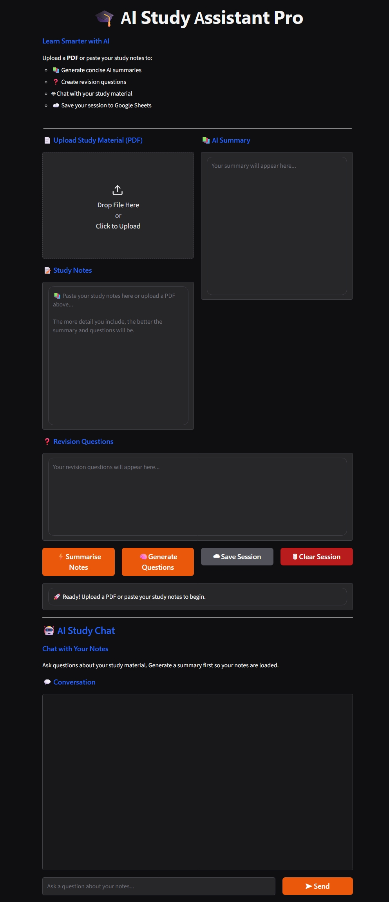
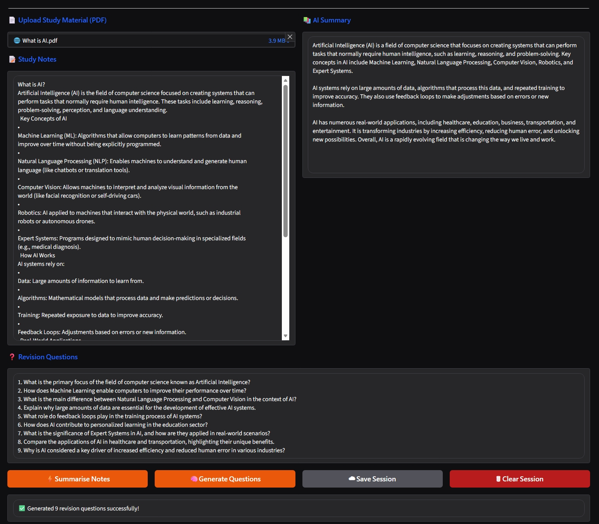
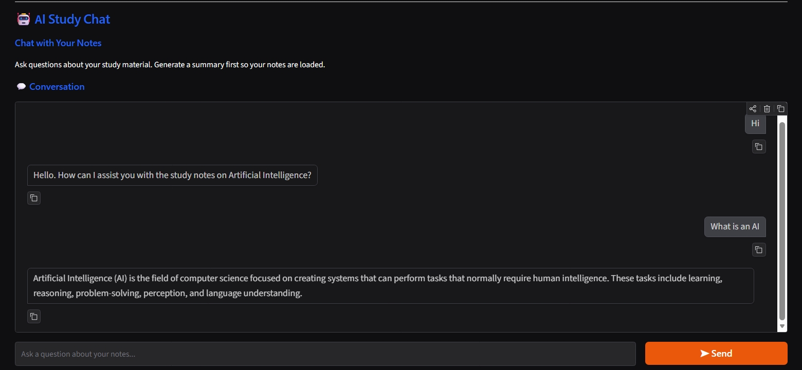
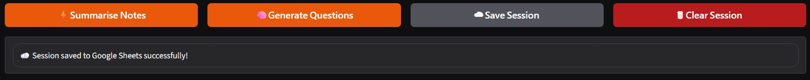

# 🎓 AI Study Assistant Pro

An AI-powered study assistant that helps students learn more effectively by generating summaries, revision questions, and answering questions from uploaded study materials.

---

## 📌 Project Overview

AI Study Assistant Pro is a web application developed as part of an internship project. It allows students to upload study notes or PDF documents, generate concise AI summaries, create revision questions, interact with their notes through an AI chatbot, and save study sessions to Google Sheets using Make.com.

---

## ✨ Features

* 📄 Upload PDF study materials
* 📝 Paste study notes manually
* 📚 AI-generated summaries
* ❓ Automatic revision question generation
* 🤖 Chat with uploaded notes using AI
* ☁️ Save study sessions to Google Sheets
* 📋 Session management
* 🪵 Logging and error handling
* 🔒 Secure API key management using `.env`

---

## 🛠️ Tech Stack

* Python 3.12
* Gradio 6.x
* Groq API (Llama 3.3 70B)
* Make.com
* Google Sheets
* PyPDF2

---

## 📂 Project Structure

```text
AI-Study-Assistant/
│
├── backend/
│   ├── chatbot.py
│   ├── groq_client.py
│   ├── logger.py
│   ├── pdf_reader.py
│   ├── question_generator.py
│   ├── session_store.py
│   ├── summarizer.py
│   └── webhook.py
│
├── logs/
├── screenshots/
├── .env.example
├── .gitignore
├── app.py
├── config.py
├── gradio_app.py
├── README.md
└── requirements.txt
```

---

## 🚀 Features Demonstration

### Home Screen



### PDF Upload


### AI Summary


### Revision Questions



### AI Chat



### Save Session



---

## ⚙️ Installation

```bash
git clone <repository-url>

cd AI-Study-Assistant

pip install -r requirements.txt
```

Create a `.env` file and configure your API keys before running the application.

Run the application:

```bash
python app.py
```

---

## 📖 Usage

1. Upload a PDF or paste study notes.
2. Generate an AI summary.
3. Generate revision questions.
4. Chat with your study material.
5. Save the session to Google Sheets.

---

## 📌 Future Improvements

* Multi-user authentication
* Multiple file uploads
* OCR support for scanned PDFs
* Export summaries as PDF
* Voice interaction

---

## 👨‍💻 Author

**PRAVEEN KS**

Internship Project – AI Study Assistant Pro
